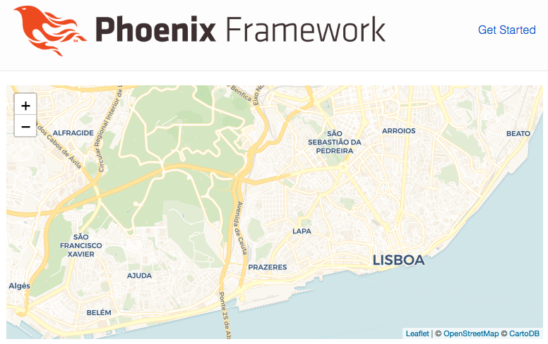

# Elixir Workshop

### Step 1: Create Project

- Install Elixir
  - https://elixir-lang.org/install.html
  - `elixir -v`

- Install Phoenix
  - `mix archive.install hex phx_new 1.4.1`

- Create project `restaurants`
  - `mix phx.new restaurants --no-ecto` (create Phoenix project without DB setup — not needed for this project)
  - Fetch and install dependencies? [Yn] y
  - `cd restaurants`

- Run initial project
  - Install `nodejs`
    - https://nodejs.org/en/download/ or https://nodejs.org/en/download/package-manager/
  - `cd assets && npm install`
  - `iex -S mix phx.server`
  - Open browser [`http://localhost:4000`](http://localhost:4000)

### Step 2: Add `tomato` library

- Communicate with the Zomato API
  - Add `tomato` library to `mix.exs`

    ```elixir
    defp deps do
      [
        ...
        {:tomato, "~> 0.1.1"},
        ...
      ]
    end
    ```

  - Configure `tomato` app

    ```elixir
    config :tomato,
      zomato_api_key: "06f7e6b2df1c9baf49e3a69a3defac49",
      zomato_api_uri: "https://developers.zomato.com/api/v2.1/"
    ```

  - Restart web app

    ```
    <Ctrl-C><Ctrl-C>

    iex -S mix phx.server
    ```

  - Explore the API of the `tomato` library and see how it maps to the Zomato REST API
    - https://github.com/dnlserrano/tomato
    - https://developers.zomato.com/documentation

  - Try to find restaurants by geolocation

    ```elixir
    Tomato.geocode(38.733563, -9.144688)
    ```

### Step 3: Add simple `/restaurants` endpoint

- Create `/restaurants` endpoint in router

  ```elixir
  # lib/restaurants_web/router.ex

  scope "/", RestaurantsWeb do
    pipe_through :browser

    get "/", PageController, :index
    get "/restaurants", RestaurantController, :index
  end
  ```

- Create controller

  ```elixir
  # lib/restaurants_web/controllers/restaurant_controller.ex

  defmodule RestaurantsWeb.RestaurantController do
    use RestaurantsWeb, :controller

    @lisbon_id 82

    def index(conn, _params) do
      {:ok, restaurants} = Tomato.search(%{entity_type: "city", entity_id: @lisbon_id})
      render(conn, "index.html", restaurants: restaurants)
    end
  end
  ```

- Create view

  ```elixir
  # lib/restaurants_web/views/restaurant_view.ex

  defmodule RestaurantsWeb.RestaurantView do
    use RestaurantsWeb, :view
  end
  ```

- Create template

  ```elixir
  # lib/restaurants_web/templates/restaurant/index.html.eex

  <%= for restaurant <- @restaurants do %>
    <li><%= restaurant.name %></li>
  <% end %>
  ```

- Visit [`http://localhost:4000/restaurants`](http://localhost:4000/restaurants) and you should see something like the following:


### Step 4: Static render of restaurants in map

- Add Leaflet.js library to render map
  - https://leafletjs.com/examples/quick-start/

  - Add `<link>` and `<script>` tags to app layout file

  ```html.eex
  # lib/restaurants_web/templates/layout/app.html.eex

  <head>
    ...
    <link rel="stylesheet" href="https://unpkg.com/leaflet@1.3.4/dist/leaflet.css" integrity="sha512-puBpdR0798OZvTTbP4A8Ix/l+A4dHDD0DGqYW6RQ+9jxkRFclaxxQb/SJAWZfWAkuyeQUytO7+7N4QKrDh+drA==" crossorigin=""/>
    <script src="https://unpkg.com/leaflet@1.3.4/dist/leaflet.js" integrity="sha512-nMMmRyTVoLYqjP9hrbed9S+FzjZHW5gY1TWCHA5ckwXZBadntCNs8kEqAWdrb9O7rxbCaA4lKTIWjDXZxflOcA==" crossorigin=""></script>
  </head>
  ```

- Update restaurant view to display Leaflet.js map

  ```html.eex
  # lib/restaurants_web/templates/restaurant/index.html.eex

  <div style="height:720px; width:1280px;" id="mapid"></div>
  <script type="text/javascript">
    window.mymap = L.map('mapid').setView([38.71667, -9.16667], 13);

    L.tileLayer('https://{s}.basemaps.cartocdn.com/rastertiles/voyager/{z}/{x}/{y}{r}.png', {
      attribution: '&copy; <a href="https://www.openstreetmap.org/copyright">OpenStreetMap</a> &copy; <a href="https://carto.com/attributions">CartoDB</a>',
      reuseTiles: true,
      detectRetina: true,
      maxZoom: 18,
      minZoom: 1,
      noWrap: true
    }).addTo(window.mymap);
  </script>
  ```

- Update max width on main container

  ```html
  # assets/css/phoenix.css

  # ...
  .container {
    # ...
    max-width: 133.0rem;
    # ...
  }
  # ...
  ```

- Visit [`http://localhost:4000/restaurants`](http://localhost:4000/restaurants) and you should see something like the following:



- Add markers for each restaurant on top of Leaflet.js map

  ```html.eex
  # lib/restaurants_web/templates/restaurant/index.html.eex

  window.mymap = ...

  <%= for restaurant <- @restaurants do %>
    var marker = L.marker([
      <%= restaurant.location.latitude %>,
      <%= restaurant.location.longitude %>,
    ]).addTo(mymap);

    marker.bindPopup("<a href=\"<%= restaurant.url %>\"><%= restaurant.name %></a></br>");
  <% end %>

  L.tileLayer(...

  ...
  ```

- Visit [`http://localhost:4000/restaurants`](http://localhost:4000/restaurants) and you should see something like the following:


### Step 5: Connect to Phoenix server via WebSockets

- Add user channel to communicate with front-end via WebSockets

  ```elixir
  # lib/restaurants_web/channels/user_socket.ex

  channel "user:*", RestaurantsWeb.UserChannel
  ```

  ```elixir
  # lib/restaurants_web/channels/user_channel.ex

  defmodule RestaurantsWeb.UserChannel do
    use RestaurantsWeb, :channel
    require Logger

    def join("user:" <> user_id, _auth, socket) do
      Logger.info("Receiving connection for user #{user_id}")
      {:ok, socket}
    end
  end
  ```

- Change socket connection to subscribe to user topic

  ```js
  // assets/js/socket.js

  ...

  const channel = socket.channel("user:123", {})

  ...

  export default socket
  export {channel}
  ```

- Create dynamic restaurants module (used in next step)

  ```js
  // assets/js/dynamic_restaurants.js

  import {channel} from "./socket"

  let DynamicRestaurants = {
    init() {
      console.log("Init DynamicRestaurants")
    },
  }

  export default DynamicRestaurants
  ```

- Glue everything together by actually calling `DynamicRestaurants.init()`

  ```js
  // assets/js/app.js

  ...

  import DynamicRestaurants from "./dynamic_restaurants"
  DynamicRestaurants.init()
  ```

- Visit [`http://localhost:4000/restaurants`](http://localhost:4000/restaurants) and you should see something like the following:


### Step 6: Static render of restaurants in map via WebSockets

- Remove rendering of restaurants via MVC model

  ```html.eex
  # lib/restaurants_web/templates/restaurant/index.html.eex
  # Remove the following code

  ...

  <%= for restaurant <- @restaurants do %>
    var marker = L.marker([
      <%= restaurant.location.latitude %>,
      <%= restaurant.location.longitude %>,
    ]).addTo(mymap);

    marker.bindPopup("<a href=\"<%= restaurant.url %>\"><%= restaurant.name %></a></br>");
  <% end %>

  ...
  ```

- Visit [`http://localhost:4000/restaurants`](http://localhost:4000/restaurants) and you should see something like the following:


- Render restaurants via WebSockets using Phoenix channels

  - Server side (back-end):

    ```elixir
    # lib/restaurants_web/channels/user_channel.ex

    ...

    def handle_in("get_restaurants", %{"coords" => %{"lat" => lat, "lng" => lng}}, socket) do
      {:ok, %{"nearby_restaurants" => restaurants}} = Tomato.geocode(lat, lng)

      response =
        restaurants
        |> Enum.map(&render_restaurant/1)

      {:reply, {:ok, %{restaurants: response}}, socket}
    end

    def render_restaurant(%{"restaurant" => restaurant}) do
      %{
        name: restaurant["name"],
        url: restaurant["url"],
        latitude: restaurant["location"]["latitude"],
        longitude: restaurant["location"]["longitude"]
      }
    end
    ```

  - Client side (front-end):

    ```js
    // assets/js/dynamic_restaurants.js

    ...

    let DynamicRestaurants = {
      init() {
        this.getRestaurants(window.mymap.getCenter())
      },

      getRestaurants(coords) {
        channel.push("get_restaurants", {coords: coords}).receive(
          "ok", ({restaurants}) => {
            restaurants.forEach(r => {
              DynamicRestaurants.renderRestaurant(r.latitude, r.longitude, r.name, r.url)
            });
          }
        )
      },

      renderRestaurant(lat, long, name, url) {
        const marker = window.L.marker(window.L.latLng(lat, long)).addTo(window.mymap);
        marker.bindPopup(`<a href="${url}">${name}</a></br>`)
      }
    }
    ```

- Visit [`http://localhost:4000/restaurants`](http://localhost:4000/restaurants) and you should see something like the following:


### Step 7: Dynamic render of restaurants in map

- Add handler for map move

  ```js
  // assets/js/dynamic_restaurants.js

  init() {
    window.mymap.on('moveend', this.handleMapMove)
    this.getRestaurants(window.mymap.getCenter())
  },

  ...

  handleMapMove() {
    DynamicRestaurants.getRestaurants(window.mymap.getCenter())
  }
  ```

- Now clear previous markers on each move

  ```html.eex
  # lib/restaurants_web/templates/restaurant/index.html.eex

  ...

  window.mymap = L.map('mapid').setView([38.71667, -9.16667], 13)
  window.layerGroup = L.layerGroup().addTo(window.mymap)

  ...
  ```

  ```js
  // assets/js/dynamic_restaurants.js

  let DynamicRestaurants = {
    ...

    renderRestaurant(lat, long, name, url) {
      const marker = window.L.marker(window.L.latLng(lat, long)).addTo(window.layerGroup)
      marker.bindPopup(`<a href="${url}">${name}</a></br>`)
    },

    handleMapMove() {
      window.layerGroup.clearLayers()
      DynamicRestaurants.getRestaurants(window.mymap.getCenter())
    }
  }
  ```

- Visit [`http://localhost:4000/restaurants`](http://localhost:4000/restaurants) and you should see something like the following:


---

The End.

We hope you enjoyed the workshop :) Thank you!
